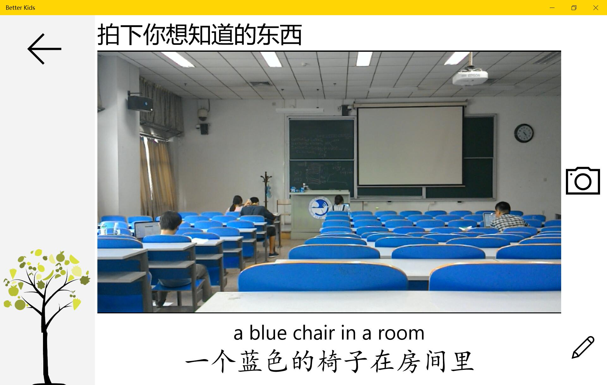
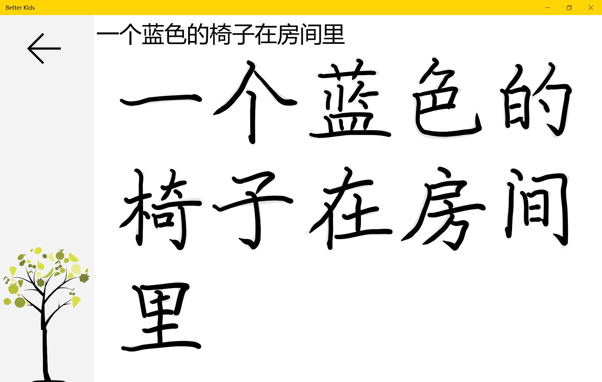

# Better-Kids

A project by Team **_Hack Tour_** (@hghwng) built in *Microsoft More Personal Computing Hackathon*, aiming to help kids learn the world.

## Motivation

More and more people are *lack of expression* under the pressure of fast pace lives, and many *autism patients* are suffering mistaking others' emotions. So we wanna build an app for kids to help them learn the world better.

## Feature

- *Guess Emotion* of a face
- *Mimic Emotion* of a face
- Learn *What-It-Is* by *Taking a Picture*
- Learn *English and Chinese*
- Learn *Chinese Handwriting*

## APIs Used

- Bing Image (Project Oxford)
- Emotion (Project Oxford)
- Computer Vision (Project Oxford)
- ~~Linguistics (Project Oxford)~~ (removed in this version)
- ~~Speech Recognition (Project Oxford)~~ (removed in this version)
- Speech Synthesis (Windows 10 / Project Oxford)
- Ink (Windows 10)
- Translation (Youdao)

## Application

- Kids Education
- Social Games

## [Demo](http://v.youku.com/v_show/id_XMTU5NjY3MzIwOA==.html)

Splash Screen

Main Page

Guess Emotion

Mimic Emotion

What-Is by Taking Picture

Chinese Characters Handwriting

## In Store

This app will be available on [Microsoft Windows Store](https://www.microsoft.com/zh-cn/store/apps/Better%20Kids/9NBLGGH4WLZH) soon.
